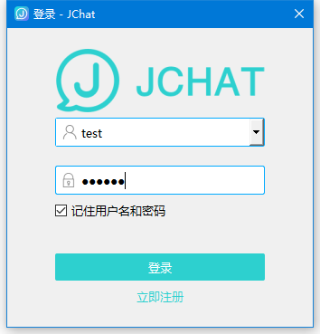

## Windows JChat

### 简介

JChat 是基于 [Windows C++ SDK](https://docs.jiguang.cn/jmessage/client/im_win_api_docs/) 带有完整 UI 界面的即时通讯应用。 演示了完整的即时通讯功能，包括：

- 单聊、群聊、会话列表、通讯录；
- 支持发送文本、图片、文件、表情、名片；
- 提供好友管理、黑名单、消息免打扰、通知栏、消息漫游、消息已读未读、会话置顶、多端在线等功能；
- 群组管理、群屏蔽、群成员禁言、群聊@XXX
- 聊天室
- 输入状态提示

- 无需成为好友也可以聊天, 通过搜索对方的用户名可直接发起会话

目前已覆盖 [Android](https://github.com/jpush/jchat-android) 、 [iOS](https://github.com/jpush/jchat-swift) 、[windows](https://github.com/jpush/jchat-windows)和 [web](https://github.com/jpush/jchat-web) 平台，开发者可参照 JChat 快速打造自己的产品，提高开发效率。

### 截图

### 环境配置

- 项目使用VS2017+Qt5.9开发,VS2017需要先安装[Qt开发插件](https://marketplace.visualstudio.com/items?itemName=TheQtCompany.QtVisualStudioTools-19123)
- 已添加Jmessage-cpp-sdk NuGet包,编译时会自动联网下载

### 依赖

- QxOrm :基于Qt的对象关系映射（ORM）操作数据库(工程已包含)

